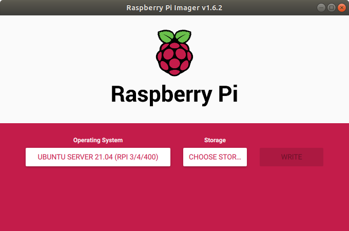

# Raspberry setup

You need to setup Raspberry Pi for both methods.

Install [Raspberry Pi Imager](https://www.raspberrypi.com/software/) on your computer. Insert SD card and run Imager. Choose 64-bit Ubuntu Server as an OS and your SD card and press `write`.



Open SD card and navigate inside the root folder of the card. The name should be something like `system-boot`.

Find the file named `network-config` and open it in a text editor. Write this to the file:
```
version: 2
ethernets:
  eth0:
    dhcp4: true
    optional: true
wifis:
  wlan0:
    dhcp4: true
    optional: true
    access-points:
      "YOUR_WIFI_NAME":
        password: "YOUR_WIFI_PASSWORD"
```

Save file, insert SD card to the Raspberry and turn it on. It must connect to your wi-fi network, now you need to find its address. Firstly find your address in the local network with:
```bash
ip a
```
It must look like `192.168.xx.xx` or `172.xx.xx.xx`.

Then scan the network with your address and zero in the end:

```bash 
$ sudo nmap -sP 192.168.xx.0/24
Starting Nmap 7.80 ( https://nmap.org ) at 2020-06-26 13:50 CEST
Nmap scan report for _gateway (192.168.43.1)
Host is up (0.015s latency).
MAC Address: 8E:F5:A3:DB:03:27 (Unknown)
Nmap scan report for ubuntu (192.168.43.56)
Host is up (0.049s latency).
MAC Address: DC:A6:32:02:46:50 (Raspberry Pi Trading)
Nmap scan report for LAPTOP-27UBLNO7 (192.168.43.234)
Host is up (0.00057s latency).
MAC Address: 7C:B2:7D:9E:95:DA (Intel Corporate)
Nmap scan report for ed-vm (192.168.43.138)
Host is up.
Nmap done: 256 IP addresses (4 hosts up) scanned in 2.07 seconds
```
There raspberry's address is `192.168.43.56`. Now you can connect to it over ssh:
```bash
ssh ubuntu@192.168.43.56
```
Password is "ubuntu".

## Home Assistant

Now we need to install Home Assistant to Raspberry. Installation instructions are [here](https://www.home-assistant.io/installation/linux#install-home-assistant-core). You need to install `Home Assistant Core`.

After installation you must be under `homeassistant` user. If you are not log in:
```bash
sudo -u homeassistant -H -s
```
From `scripts` folder import `send_datalog.py` script which will send received data to Robonomics, `control.py` which allows home assistant to receive commands from datalog, and file `config.config`, containing mnemonic seed:

```bash
cd /srv/homeassistant/
mkdir python_scripts
cd python_scripts/
wget https://raw.githubusercontent.com/tubleronchik/robonomics-smarthome/main/scripts/send_datalog.py
wget https://raw.githubusercontent.com/tubleronchik/robonomics-smarthome/main/scripts/control.py
wget https://raw.githubusercontent.com/tubleronchik/robonomics-smarthome/main/scripts/config.config
```

Add mnemonic seed from your account in config.config:
```
[secrets]
MNEMONIC_SEED = <your mnemonic>
```

## Substrate Interface

To pub data to Robonomics you need to install `substrate-interface` python package (you need to install RUST before) to your raspberry. Be sure that you're logged in as `homeassistant` user, if not do the following:
```bash
sudo -u homeassistant -H -s
```
Then install RUST:
```bash
curl --proto '=https' --tlsv1.2 -sSf https://sh.rustup.rs | sh
source $HOME/.cargo/env
rustup default nightly
```
And install nessesary python packages to the virtual environment:
```bash
sudo apt install libcurl4-openssl-dev libssl-dev
cd /srv/homeassistant
source bin/activate
pip3 install pynacl packaging pycurl substrate-interface
```
## Systemd services

Now change user (you can run under any user, which allows you to use sudo):

```bash
su ubuntu
```

Move to /etc/systemd/system and create new service for home assistant start: 

```bash
cd /etc/systemd/system
sudo nano home-assistant@homeassistant.service 
```

Paste the following:

```
[Unit]
Description=Home Assistant
After=network-online.target
[Service]
Type=simple
User=%i
WorkingDirectory=/srv/%i/
ExecStart=/srv/homeassistant/bin/hass -c "/home/%i/.homeassistant"
Environment="PATH=/srv/%i/bin"

[Install]
WantedBy=multi-user.target
```

Do the same for robonomics control service:

```bash
sudo nano robonomics-contol@homeassistant.service 
```
With:

```
[Unit]
Description=Robonomics Control
After=network-online.target
[Service]
Type=simple
User=%i
WorkingDirectory=/srv/%i/
ExecStart=/srv/homeassistant/bin/python3.8 "/srv/%i/python_scripts/control.py"
Environment="PATH=/srv/%i/bin"

[Install]
WantedBy=multi-user.target
```

And enable both services:
```
sudo systemctl enable home-assistant@homeassistant.service
sudo systemctl enable robonomics-contol@homeassistant.service
```

