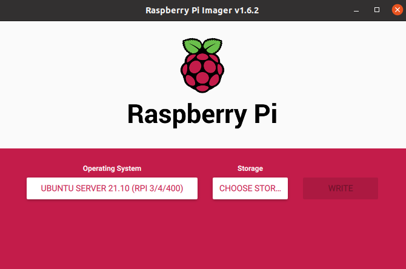

# Raspberry setup

You need to setup Raspberry Pi for both methods.

Install [Raspberry Pi Imager](https://www.raspberrypi.com/software/) on your computer. Insert SD card and run Imager. Choose 64-bit Ubuntu Server as an OS and your SD card and press `write`.



Open SD card and navigate inside the root folder of the card. The name should be something like `system-boot`.

Find the file named `network-config` and open it in a text editor. Write this to the file:
```
version: 2
ethernets:
  eth0:
    dhcp4: true
    optional: true
wifis:
  wlan0:
    dhcp4: true
    optional: true
    access-points:
      "YOUR_WIFI_NAME":
        password: "YOUR_WIFI_PASSWORD"
```

Save file, insert SD card to the Raspberry and turn it on. It must connect to your wi-fi network, now you need to find its address. Firstly find your address in the local network with:
```bash
ip a
```
It must look like `192.168.xx.xx` or `172.xx.xx.xx`.

Then scan the network with your address and zero in the end:

```bash 
$ sudo nmap -sP 192.168.xx.0/24
Starting Nmap 7.80 ( https://nmap.org ) at 2020-06-26 13:50 CEST
Nmap scan report for _gateway (192.168.43.1)
Host is up (0.015s latency).
MAC Address: 8E:F5:A3:DB:03:27 (Unknown)
Nmap scan report for ubuntu (192.168.43.56)
Host is up (0.049s latency).
MAC Address: DC:A6:32:02:46:50 (Raspberry Pi Trading)
Nmap scan report for LAPTOP-27UBLNO7 (192.168.43.234)
Host is up (0.00057s latency).
MAC Address: 7C:B2:7D:9E:95:DA (Intel Corporate)
Nmap scan report for ed-vm (192.168.43.138)
Host is up.
Nmap done: 256 IP addresses (4 hosts up) scanned in 2.07 seconds
```
There raspberry's address is `192.168.43.56`. Now you can connect to it over ssh:
```bash
ssh ubuntu@192.168.43.56
```
Password is "ubuntu".

## Home Assistant

Now we need to install Home Assistant to Raspberry. Installation instructions are [here](https://www.home-assistant.io/installation/linux#install-home-assistant-core). You need to install `Home Assistant Core`.

After installation create `send_datalog.py` script that will send receiving data to Robonomics:

```bash
sudo nano /srv/homeassistant/python_scripts/send_datalog.py
```

And add the folloving (replace `<mnemonic>` with mnemonic seed from your account in Robonomics Network):
```python
from substrateinterface import SubstrateInterface, Keypair
import time
import sys
from Crypto.PublicKey import RSA
from Crypto.Cipher import PKCS1_OAEP
import binascii
import nacl.secret
import base64

mnemonic = <mnemonic>
substrate = SubstrateInterface(
                    url="wss://main.frontier.rpc.robonomics.network",
                    ss58_format=32,
                    type_registry_preset="substrate-node-template",
                    type_registry={
                        "types": {
                            "Record": "Vec<u8>",
                            "<T as frame_system::Config>::AccountId": "AccountId",
                            "RingBufferItem": {
                                "type": "struct",
                                "type_mapping": [
                                    ["timestamp", "Compact<u64>"],
                                    ["payload", "Vec<u8>"],
                                ],
                            },
                        }
                    }
                )

keypair = Keypair.create_from_mnemonic(mnemonic, ss58_format=32)
seed = keypair.seed_hex
b = bytes(seed[0:32], "utf8")
box = nacl.secret.SecretBox(b)
data = ' '.join(sys.argv[1:])
data = bytes(data, 'utf-8')

encrypted = box.encrypt(data)
text = base64.b64encode(encrypted).decode("ascii")
print(f"Got message: {data}")
call = substrate.compose_call(
        call_module="Datalog",
        call_function="record",
        call_params={
            'record': text
        }
    )
extrinsic = substrate.create_signed_extrinsic(call=call, keypair=keypair)
receipt = substrate.submit_extrinsic(extrinsic, wait_for_inclusion=True)
print(f"Datalog created with extrinsic hash: {receipt.extrinsic_hash}")
```

## Substrate Interface

To pub data to Robonomics you need to install `substrate-interface` python package (you need to install RUST before) to your virtual environment:

```bash
curl --proto '=https' --tlsv1.2 -sSf https://sh.rustup.rs | sh
source $HOME/.cargo/env
rustup default nightly
cd /srv/homeassistant
source bin/activate
pip3 install substrate-interface
```
