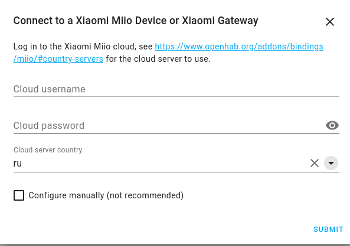
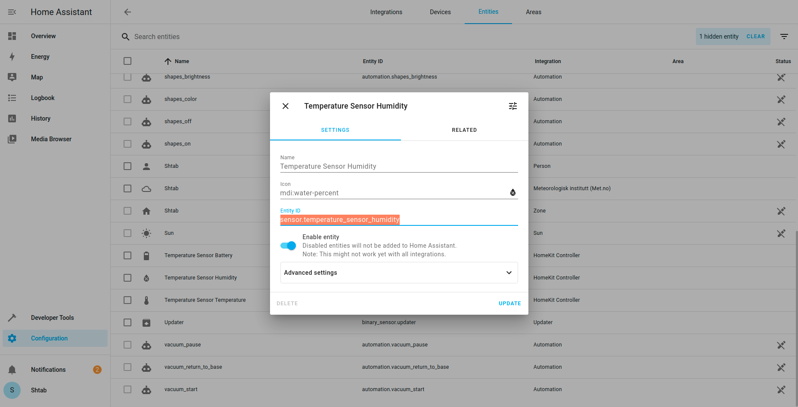

# Sensors Connection Method 2 (with Xiaomi Gateway)

You need your gateway with all sensors to be connected to the Mi Home app. If you haven't done this yet press `+` button on the top right corner, find your hub (it must be in connecting mode with long press to power button) and follow instructions in the app. After you add the gateway, you need to add sensors: press on your gateway, then go to `Child device` and press `+`. Find required device and follow the instructions on the screen. For more details look at user manual of your hub.

## Add Gateway to Home Assistant

Start Home Assistant if you haven't done it yet:
```bash
cd /srv/homeassistant
hass
```

In your Home Assistant:
```
http://<raspberry_address>:8123
```
Go to `Configuration/Integrations` and press `Add Intagration`. There you need to Find `Xiaomi Miio`:


Then fill your username (or phone) and password from Mi Home account and choose your country server:



Press `Submit` and choose your Hub (Aqara Hub in this example):


Press `Submit` and you will be able to see your gateway in Integrations page.

Then we need to setup action to send data to Robonomics. For that open a configuration file:

```bash
nano ~/.homeassistant/configuration.yaml
```

And add following to the end of file:

```
automation:
  - alias: "send_datalog_temperature_sensor"
    trigger:
      platform: time_pattern
      minutes: "/5"
    action:
      service: shell_command.send_datalog_temperature_sensor

  - alias: "send_datalog_contact_sensor"
    trigger:
      platform: state
      entity_id:
        - binary_sensor.contact_sensor
    action:
      service: shell_command.send_datalog_contact_sensor

shell_command:
  send_datalog_temperature_sensor: 'python3 python_scripts/send_datalog.py sensor_humidity={{ states("sensor.temperature_sensor_humidity") }} sensor_temp={{ states("sensor.temperature_sensor_temperature") }} sensor_battery={{ states("sensor.temperature_sensor_battery") }}'
  send_datalog_contact_sensor: 'python3 python_scripts/send_datalog.py sensor_contact={{ states("binary_sensor.contact_sensor") }}'
```

You can choose how often you want to send data with changing the value in `minutes: "/5"`.

The names of the data in `shell_command` like `temperature_sensor_humidity` may be different. You can find your option in `Configuration/Entities`. Find your sensor and copy Entity ID.



Restart Home Assistant. You can add the data from sensors to your homepage like in `Home Assistant setup` in the description to Method 1.
